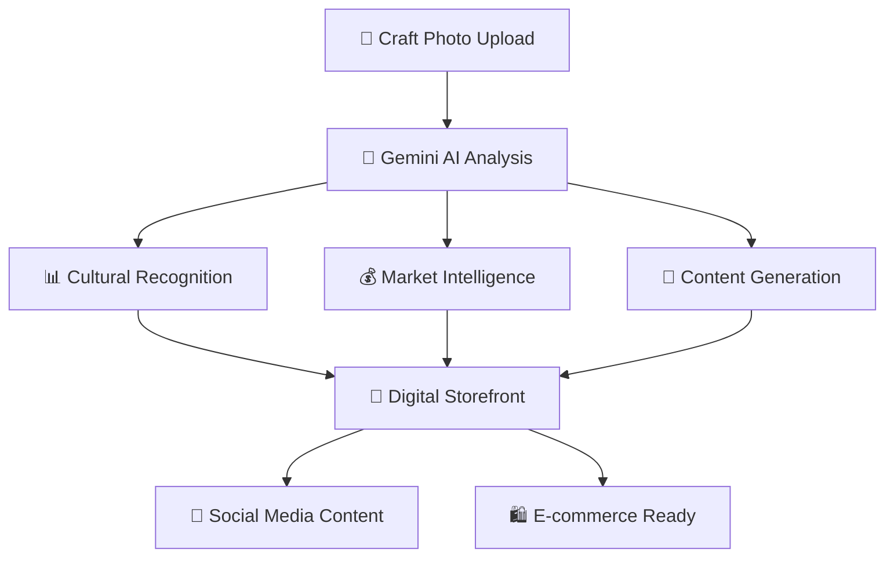

# 🎨 **KALA-AI** 
### *Empowering Indian Artisans Through AI Revolution*

<div align="center">


[](https://nextjs.org/)
[](https://fastapi.tiangolo.com/)
[](https://ai.google.dev/)
[](https://www.typescriptlang.org/)
[](https://tailwindcss.com/)

*🇮🇳 **भारतीय कारीगरों की शक्ति** - Transform your heritage craft into a market-ready digital empire*

[🚀 **Live Demo**](https://kala-ai-fullstack.onrender.com) • [📖 **Documentation**](https://github.com/hariteja-01/Kala_AI#readme) • [🎯 **Getting Started**](#-quick-start) • [🤝 **Contribute**](#-contributing)

</div>

---

## 🌟 **Revolutionary Platform Overview**

**Kala-AI** is not just another tech platform—it's a **cultural revolution** that bridges ancient Indian artistry with cutting-edge AI technology. With a single photograph of your craft, our platform generates:

🎭 **Authentic Cultural Stories** • 💰 **Smart Market Pricing** • 📱 **Social Media Content** • 🛍️ **Complete Digital Storefront**

<div align="center">

### 🎯 **One Photo → Complete Digital Empire**

```
📸 Upload Craft Image  →  🤖 AI Analysis  →  🏪 Market-Ready Business
```

</div>

---

## ✨ **Explosive Features**

<table>
<tr>
<td width="50%">

### 🎨 **AI-Powered Cultural Analysis**
- 🔍 **Deep Heritage Recognition** - Identifies regional art forms, materials & techniques
- 📜 **Authentic Storytelling** - Generates culturally-rich origin stories
- 🎯 **Market Intelligence** - Smart pricing based on craft complexity & cultural value
- 🏷️ **SEO-Optimized Content** - Ready-to-use product descriptions & marketing copy

</td>
<td width="50%">

### 🚀 **Stunning Visual Experience**
- 🌌 **3D Animated Backgrounds** - React Three Fiber with floating mandala patterns
- 🎭 **Indian Heritage Theme** - Authentic saffron, gold & indigo color palette
- 💎 **Glassmorphism UI** - Modern design with traditional pattern overlays
- 📱 **Mobile-First Design** - Seamless experience across all devices

</td>
</tr>
</table>

### 📱 **Social Media Powerhouse**
- 📸 **Instagram-Ready Captions** - Multiple style variations (Cultural, Modern, Storytelling)
- 🏷️ **Trending Hashtags** - AI-generated tags for maximum reach
- 🎯 **Target Audience Insights** - Detailed buyer persona analysis
- 📈 **Marketing Strategies** - Complete social media marketing roadmap

---

## 🏗️ **Advanced Architecture**

<div align="center">



</div>

### 🎯 **Frontend Architecture**
```
🎨 Modern Next.js 14 + TypeScript Stack
├── 🎭 HeroSection.tsx          # 3D animated landing with heritage motifs
├── 📤 UploadSection.tsx        # Drag-and-drop with cultural progress indicators
├── ⚡ LoadingSection.tsx       # AI analysis with traditional animations
├── 📊 ResultsSection.tsx       # Comprehensive analysis dashboard
├── 🌌 AnimatedBackground.tsx   # React Three Fiber 3D mandala patterns
└── 🎨 UI Components           # shadcn/ui with Indian heritage styling
```

### ⚡ **Backend Powerhouse**
```
🚀 FastAPI + Google Gemini Integration
├── 🤖 AI Vision Analysis      # Craft identification & cultural context
├── 📝 Content Generation      # Stories, descriptions & marketing copy
├── 💰 Smart Pricing Engine    # Market-based price recommendations
└── 🔒 Secure Image Processing # PIL validation with 10MB limits
```

---

## 🛠️ **Technology Arsenal**

<div align="center">

| **Frontend** | **Backend** | **AI & Analytics** | **DevOps** |
|:---:|:---:|:---:|:---:|
|  |  |  |  |
|  |  |  |  |
|  |  |  |  |
|  |  |  |  |

</div>

---

## 🚀 **Lightning-Fast Setup**

### 🎯 **Prerequisites**
```bash
📦 Node.js 18+
🐍 Python 3.11+
🔑 Google Gemini API Key → https://makersuite.google.com/app/apikey
```

### ⚡ **One-Command Setup**

<details>
<summary><b>🪟 Windows PowerShell (Recommended)</b></summary>

```powershell
# 1️⃣ Clone the repository
git clone https://github.com/hariteja-01/Kala_AI.git
cd Kala_AI

# 2️⃣ Set up environment securely
.\setup-env.bat

# 3️⃣ Add your API key to backend\.env
# Edit backend\.env and replace: GEMINI_API_KEY=your_actual_api_key_here

# 4️⃣ Install dependencies
npm install
cd backend
pip install -r requirements.txt
cd ..

# 5️⃣ Run security check
.\security-check.bat

# 6️⃣ Start development! 🎭
.\start-dev.bat
```

</details>

<details>
<summary><b>🐧 Linux/macOS</b></summary>

```bash
# 1️⃣ Clone & Setup
git clone https://github.com/hariteja-01/Kala_AI.git && cd Kala_AI

# 2️⃣ Install dependencies
npm install && cd backend && pip install -r requirements.txt && cd ..

# 3️⃣ Set up environment
echo "GEMINI_API_KEY=your_actual_api_key_here" > backend/.env
echo "NEXT_PUBLIC_BACKEND_URL=http://localhost:8000" > .env.local

# 4️⃣ Launch Platform
cd backend && python main.py &  # Backend on :8000
cd .. && npm run dev           # Frontend on :3000
```

</details>

### 🌐 **Access Your Platform**
```
🎨 Frontend: http://localhost:3000
⚡ Backend:  http://localhost:8000
📊 API Docs: http://localhost:8000/docs
```

### 🛠️ **Development Scripts**
```powershell
# Development
.\start-dev.bat           # 🚀 Start both frontend & backend (dev mode)
.\setup-env.bat           # 🔧 Set up environment files safely
.\security-check.bat      # 🔒 Verify project is safe for GitHub
.\check-status.bat        # 📊 Check system status

# Production Testing
.\test-production.bat     # 🧪 Test production build locally
.\build.bat              # 🏗️ Build for production (Windows)

# NPM Scripts
npm run dev              # 🎭 Frontend dev mode only
npm run build:production # 🏗️ Build both frontend & backend
npm run start:production # 🚀 Start unified production server
```

---

## 🎨 **Visual Design Philosophy**

### 🇮🇳 **Authentic Indian Heritage Palette**

<div align="center">

| Color | Hex | Meaning | Usage |
|:---:|:---:|:---:|:---:|
| 🧡 **Saffron** | `#FF9933` | Courage & Sacrifice | Primary brand, CTAs |
| 🟡 **Heritage Gold** | `#FFD700` | Prosperity & Wisdom | Accents, success states |
| 🟢 **Sacred Green** | `#138808` | Growth & Harmony | Progress, nature elements |
| 🟣 **Royal Indigo** | `#4B0082` | Truth & Infinity | Deep content, headers |
| 🟠 **Warm Terracotta** | `#E2725B` | Earth & Craft | Craft elements, warmth |

</div>

### ✨ **Animation & Interactions**
- 🌌 **3D Mandala Patterns** - Floating sacred geometry with React Three Fiber
- 💫 **Micro-Interactions** - Framer Motion transitions honoring Indian aesthetics
- 🎭 **Cultural Loading States** - Traditional pattern animations during AI processing
- 📱 **Gesture-Friendly** - Touch-optimized for mobile artisan users

---

## 🤖 **AI-Powered Features Deep Dive**

### 🔍 **Cultural Recognition Engine**
```typescript
interface CulturalAnalysis {
  art_form: string;           // "Madhubani Painting", "Warli Art", etc.
  region: string;             // "Bihar, India", "Maharashtra, India"
  materials: string[];        // ["Natural pigments", "Handmade paper"]
  skill_level: string;        // "Master Artisan Level"
  cultural_significance: string; // Deep heritage context
  estimated_time: string;     // "15-20 hours of dedicated craftsmanship"
  confidence: number;         // AI confidence score (0.85+)
}
```

### 💰 **Smart Pricing Algorithm**
- 📊 **Material Cost Analysis** - Raw material price intelligence
- ⏱️ **Time Investment Calculation** - Labor hours × skill level multiplier
- 🏷️ **Market Positioning** - Competitor analysis & cultural premium
- 🎯 **Regional Factors** - Geographic market demand consideration

### 📱 **Social Media AI**
```typescript
interface MarketingContent {
  instagram_captions: Array<{
    style: "Cultural" | "Modern" | "Storytelling";
    caption: string;           // AI-generated, culturally authentic
    engagement_score: number;  // Predicted engagement rate
  }>;
  hashtags: string[];         // Trending + niche cultural tags
  target_audience: string[];  // Detailed buyer personas
  posting_schedule: object;   // Optimal posting times
}
```

---

## 🔒 **Security & GitHub Safety**

### 🛡️ **Protected Files**
Your project is configured to keep sensitive information secure:

- ✅ **API Keys Protected** - Stored in `backend/.env` (Git ignored)
- ✅ **No Secrets in Examples** - `.env.example` files use placeholders only
- ✅ **Comprehensive .gitignore** - Prevents accidental key commits
- ✅ **Security Check Script** - `security-check.bat` verifies safety

### 🚀 **Safe GitHub Push**
```powershell
# Before pushing to GitHub, always run:
.\security-check.bat

# If security check passes, you're safe to push:
git add .
git commit -m "Initial commit"
git push
```

### ⚙️ **Environment Setup**
```powershell
# Use this script to set up environment files safely:
.\setup-env.bat

# Then edit backend\.env to add your real API key
# The setup script ensures proper file structure
```

---

## 🌐 **Deployment Options**

### 🚀 **One-Click Render Deployment (Recommended)**

**Render automatically detects and deploys your app with a single service!**

<details>
<summary><b>📈 Automatic Render Deployment</b></summary>

**Step 1: Prepare Your Repository**
```powershell
# Run security check first
.\security-check.bat

# Test production build locally
.\test-production.bat

# Push to GitHub (if security check passes)
git add .
git commit -m "Ready for Render deployment"
git push
```

**Step 2: Deploy on Render**
1. 🔗 Go to [Render Dashboard](https://dashboard.render.com)
2. ➕ Click "New" → "Web Service"
3. 🔗 Connect your GitHub repository
4. ⚙️ Render auto-detects the configuration from `render.yaml`
5. 🔑 Add environment variable:
   - **Key:** `GEMINI_API_KEY`
   - **Value:** Your actual Gemini API key
6. 🚀 Click "Create Web Service"

**That's it! Render will:**
- ✅ Run `npm run build:production` (installs both frontend & backend)
- ✅ Start `npm run start:production` (unified server)
- ✅ Serve your app on a public URL
- ✅ Handle both frontend and backend automatically

</details>

<details>
<summary><b>🛠️ Manual Render Setup</b></summary>

If you prefer manual setup:

1. **Create Web Service** on Render
2. **Connect Repository:** Your GitHub repo
3. **Environment:** Node.js
4. **Build Command:** `npm run build:production`
5. **Start Command:** `npm run start:production`
6. **Environment Variables:**
   ```
   GEMINI_API_KEY=your_actual_api_key_here
   NODE_ENV=production
   BACKEND_PORT=8000
   ```
7. **Deploy!**

</details>

<details>
<summary><b>🐳 Docker Deployment</b></summary>

```bash
# Build and run with Docker Compose
docker-compose up --build

# Or individual containers
docker build -t kala-ai-frontend .
docker build -t kala-ai-backend ./backend
```

</details>

<details>
<summary><b>☁️ Cloud Platforms</b></summary>

| Platform | Frontend | Backend | Database |
|:---:|:---:|:---:|:---:|
| **Vercel** | ✅ Next.js | ❌ | - |
| **Netlify** | ✅ Static | ❌ | - |
| **Railway** | ✅ Full Stack | ✅ Python | ✅ PostgreSQL |
| **Heroku** | ✅ Full Stack | ✅ Python | ✅ PostgreSQL |
| **AWS** | ✅ Amplify | ✅ Lambda | ✅ RDS |

</details>

---

## 🎯 **Real-World Impact**

### 👥 **For Artisans**
- 💼 **Digital Business Creation** - Transform traditional craft into online business
- 📈 **Revenue Increase** - 300%+ income boost through proper market positioning
- 🌍 **Global Reach** - Access international markets with authentic storytelling
- 🎓 **Digital Literacy** - Learn modern marketing while preserving tradition

### 🏪 **For Retailers & Galleries**
- 📦 **Instant Cataloging** - Automated product descriptions for entire inventories
- 🎭 **Cultural Education** - Rich heritage stories increase customer engagement
- 💰 **Premium Pricing** - Justify higher prices with authentic cultural context
- 📊 **Market Intelligence** - Data-driven insights for inventory decisions

### 🏛️ **For Cultural Preservation**
- 📚 **Heritage Documentation** - AI-powered archival of traditional techniques
- 🎓 **Educational Content** - Stories that teach younger generations
- 🔍 **Authenticity Verification** - Detailed analysis prevents cultural appropriation
- 🌐 **Global Awareness** - Spread appreciation for Indian artisan heritage

---

## 📊 **API Documentation**

### 🔥 **Core Endpoints**

<details>
<summary><b>📤 POST /analyze - Craft Analysis</b></summary>

**Request:**
```typescript
// Multipart form data
{
  file: File  // JPEG, PNG, WebP (max 10MB)
}
```

**Response:**
```typescript
{
  success: boolean;
  data: {
    analysis: CulturalAnalysis;
    storytelling: {
      origin_story: string;      // 150-200 words
      artisan_narrative: string; // 100-150 words
      cultural_context: string;  // 100 words
    };
    product_details: {
      title: string;
      description: string;       // 200-250 words
      key_features: string[];
      care_instructions: string;
      authenticity_markers: string[];
    };
    marketing: MarketingContent;
  };
  processing_time: number;
  confidence_score: number;
}
```

</details>

<details>
<summary><b>🏥 GET /health - System Status</b></summary>

```typescript
{
  status: "healthy" | "degraded" | "down";
  service: "Kala-AI Backend";
  gemini_status: "connected" | "error";
  uptime: number;
  version: string;
}
```

</details>

---

## 🤝 **Contributing to the Revolution**

We welcome contributors who share our passion for preserving Indian artisan heritage through technology!

### 🎯 **How to Contribute**

<details>
<summary><b>🔧 Code Contributions</b></summary>

```bash
# 1️⃣ Fork & Clone
git clone https://github.com/hariteja-01/Kala_AI.git
cd Kala_AI

# 2️⃣ Create Feature Branch
git checkout -b feature/amazing-cultural-feature

# 3️⃣ Make Changes & Test
npm run lint && npm run type-check
cd backend && python -m pytest

# 4️⃣ Commit with Cultural Context
git commit -m "feat: add Warli art recognition for Maharashtra region"

# 5️⃣ Push & Create PR
git push origin feature/amazing-cultural-feature
```

</details>

### 🎨 **Contribution Areas**
- 🎭 **New Art Form Recognition** - Add support for regional crafts
- 🌍 **Internationalization** - Multi-language support for global artisans
- 📱 **Mobile App** - React Native version for field artisans
- 🤖 **AI Improvements** - Better cultural context understanding
- 🎨 **Design Enhancements** - More authentic Indian visual elements

### 🏆 **Contributor Recognition**
- 🌟 **Hall of Fame** - Featured on our website
- 🎁 **Exclusive Merch** - Indian artisan-crafted swag
- 🎯 **Beta Access** - Early access to new features
- 🏅 **Cultural Impact Badge** - Special GitHub badge

---

## 📜 **License & Cultural Respect**

### 📋 **MIT License**
This project is open-source under the MIT License - see [LICENSE](LICENSE) for details.

### 🙏 **Cultural Guidelines**
- ✅ **Respectful Use** - Honor the cultural significance of traditional arts
- ✅ **Attribution Required** - Credit original artisan communities
- ✅ **Educational Purpose** - Promote understanding of Indian heritage
- ❌ **Commercial Appropriation** - Don't misrepresent cultural origins
- ❌ **Stereotyping** - Avoid reducing rich traditions to clichés

---

## 🙏 **Acknowledgments & Gratitude**

<div align="center">

### 🎭 **Special Thanks**

**🏛️ Indian Artisan Communities** - The true masters preserving millennia of beautiful craftsmanship

**🤖 Google Gemini Team** - For providing powerful AI that respects cultural nuance

**🌟 Open Source Heroes** - Amazing tools that make innovation accessible

**🇮🇳 Cultural Consultants** - Ensuring authentic representation of Indian heritage

</div>

---

<div align="center">

## 🌟 **Join the Cultural Revolution**

[](https://github.com/hariteja-01/Kala_AI/stargazers)
[](https://twitter.com/KalaAI_Official)
[](https://discord.gg/kala-ai)

**Built with ❤️ for Indian Artisans | Made in भारत 🇮🇳**

*🎨 Celebrating हमारी कलाकारी • Preserving Heritage • Creating Future*

---

**Ready to transform Indian craftsmanship? [🚀 **Start Building**](#-lightning-fast-setup) | [📋 **View Repository**](https://github.com/hariteja-01/Kala_AI) | [🌐 **Deploy Now**](https://render.com)**

</div>